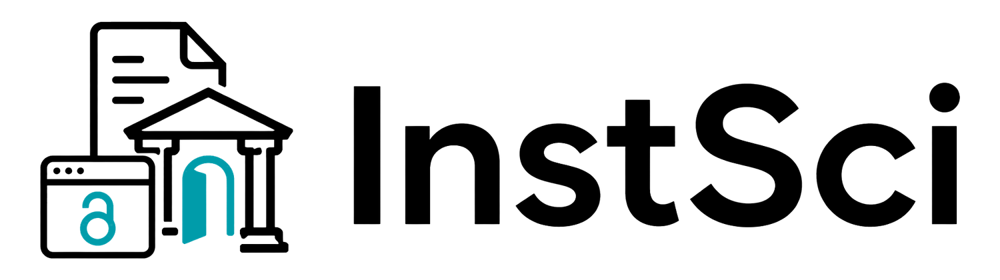

<p align="center">
  
</p>

<p align="center">
  <a href="pyproject.toml"></a>
  <a href="pyproject.toml">=3.10"></a>
  <a href="LICENSE"></a>
  
</p>

[中文](#中文) | [English](#english)

## 中文

InstSci 是一个面向科研用户和 AI Agent 的论文获取工具。它优先查找开放获取全文；遇到需要订阅权限的论文时，会通过可见浏览器复用你自己的学校、图书馆或机构访问权限。

### 主要能力

- 开放获取优先：Unpaywall、arXiv、Semantic Scholar、出版社元数据。
- 机构访问辅助：支持 Shibboleth、OpenAthens、CARSI、WebVPN、EZproxy 等常见路径。
- 出版社工作流：覆盖 ACM、ACS、AIP、IEEE、IOP、Nature、Oxford、RSC、ScienceDirect、Springer、Wiley 等。
- 批量下载：可保持可见 CloakBrowser 会话，减少重复登录。
- Agent 友好：提供 `instsci-mcp`，可接入支持 MCP 的 AI 工具。

### 安装

推荐用户安装（发布到 PyPI 前请从 GitHub 安装）：

```bash
pipx install git+https://github.com/Rimagination/instsci.git
# or
uv tool install git+https://github.com/Rimagination/instsci.git
```

开发者安装：

```bash
git clone https://github.com/Rimagination/instsci.git
cd instsci
pip install -e .
```

当前命令和包名都是 `instsci`。

一句话安装 MCP 和 skill：

```text
帮我安装这个 mcp 和 skill：https://github.com/Rimagination/instsci
```

CloakBrowser 浏览器由 InstSci 缓存在项目内的 `instsci/_browsers/cloakbrowser`，该目录不会提交到 Git。

### 快速开始

Elsevier API key 是项目级全局配置，配置一次后会用于后续所有 ScienceDirect DOI；`--validate` 只用样例 DOI 做下载验证。Inst Token 不是必需的，只有图书馆明确提供 Elsevier institutional token 时才需要配置。Elsevier 下载优先走 `view=FULL XML -> object/eid -> PDF`，并先用 direct route 让 `api.elsevier.com` 走校园网、学校 VPN、规则 VPN 或图书馆出口。

```bash
instsci setup --school "你的学校或机构"
instsci elsevier-setup --api-key YOUR_ELSEVIER_KEY --validate
instsci search "perovskite solar cells" --limit 10
instsci fetch "10.1038/s41586-020-2649-2"
instsci papers dois.txt --publisher auto --output ./runs/papers
```

MCP：

```bash
instsci-mcp
```

### 访问与合规

InstSci 不接收你的密码。需要 SSO、2FA、验证码或出版社验证时，请在弹出的 CloakBrowser 中手动完成。HTTP 诊断工具只能作为预检查；最终能否拿到出版社 PDF，应以可见浏览器工作流的结果为准。

### 许可证

[MIT](LICENSE)

<a id="english"></a>

## English

InstSci is a paper retrieval toolkit for researchers and AI agents. It looks for Open Access full text first; when a paper requires subscription access, it helps reuse your own university, library, or institutional entitlement through a visible browser session.

### Highlights

- Open Access first: Unpaywall, arXiv, Semantic Scholar, and publisher metadata.
- Institutional access support: Shibboleth, OpenAthens, CARSI, WebVPN, EZproxy, and similar routes.
- Publisher workflows: ACM, ACS, AIP, IEEE, IOP, Nature, Oxford, RSC, ScienceDirect, Springer, Wiley, and more.
- Batch downloads with a visible CloakBrowser session to reduce repeated sign-ins.
- Agent-ready MCP server via `instsci-mcp`.

### Install

Recommended user install (until the PyPI package is published):

```bash
pipx install git+https://github.com/Rimagination/instsci.git
# or
uv tool install git+https://github.com/Rimagination/instsci.git
```

Development install:

```bash
git clone https://github.com/Rimagination/instsci.git
cd instsci
pip install -e .
```

The command and package name are both `instsci`.

One-line MCP and skill install:

```text
Install this MCP and skill: https://github.com/Rimagination/instsci
```

InstSci caches the CloakBrowser binary inside `instsci/_browsers/cloakbrowser`; that directory is not committed to Git.

### Quick Start

The Elsevier API key is a project-wide global setting. Configure it once for later ScienceDirect DOI retrieval; `--validate` only uses a sample DOI as a download smoke test. Inst Token is optional and should be set only when your library explicitly provides an Elsevier institutional token. Elsevier downloads prefer `view=FULL XML -> object/eid -> PDF`, using the direct route first so `api.elsevier.com` can use your campus, school VPN, rule VPN, or library exit.

```bash
instsci setup --school "Your Institution"
instsci elsevier-setup --api-key YOUR_ELSEVIER_KEY --validate
instsci search "perovskite solar cells" --limit 10
instsci fetch "10.1038/s41586-020-2649-2"
instsci papers dois.txt --publisher auto --output ./runs/papers
```

MCP:

```bash
instsci-mcp
```

### Access And Compliance

InstSci never asks for your password. When SSO, 2FA, CAPTCHA, or publisher verification appears, complete it manually in the visible CloakBrowser window. HTTP diagnostics are preflight checks only; final publisher PDF availability should come from a visible browser-backed workflow.

### License

[MIT](LICENSE)
